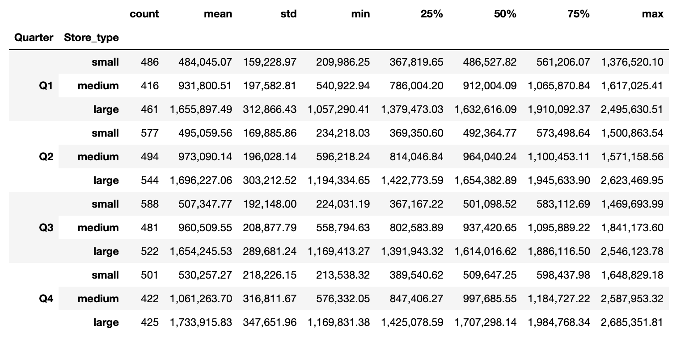

<h1 align="center">Capstone Project Walmart</h1> 


**Author: Chris Freyre**

## Project Overview & Business Problem

In this project I researched and found my dataset as a csv file from Kaggle, only for educational purposes. 

Walmart has been running out of stock during busy periods recently and are looking for a way to predict future sales in order to maintain appropriate levels of stock.

## Data Understanding

Walmart.csv file contains 6,435 rows and 8 columns for the period of 2010-2012. Analysing the data we can say that it has 45 stores, a price in relation to weekly sales, holiday days, temperature, fuel price, Consumer price index (CPI) and unemployment. 

Columns:

  * Store         45 stores
  * Date          day-month-year of sale
  * Weekly_Sales  sales in given stores
  * Holiday_Flag  0 for no holiday day | 1 for holiday day
  * Temperature   ℉ in days of sales
  * Fuel_price    Fuel cost on days of sales
  * CPI           Consumer price index
  * Unemployment  Unemployment rate
  
  

## Data Cleaning
  
* I started checking for missing and unique values in each column. 
* Proceeded to convert date into weeks, months and year.
* Created a segmentation of the data by Quarters for better usage.
* Outliers found in weekly sales, temperature and unemployment, that performinng the IQR Trimming and Capping method got removed.
* Created dummie variables for categorical data.
* Performed Log Transformations further on in Weekly sales, temperature, fuel price, CPI and unemployment.
* Also performed standarisation of the data.


## Modeling

The first 4 models were a great success in terms of the r-squared value being 0.977. The mse in cross validation were slowly reduced, but not enough to provide a satifactory result. I further analysed and created new variables for future models mainly based on categorisation of stores and segmentation of weekly sales by quarter.


## Summary

The last model provided the best fit for linear regression with an R-squared value of 0.805, meaning that it represents 80.5% of the data, validating it with a T-test provided a Mean Squared Error value of 0.0377 and a Cross Validation result of 0.087.


## Recommendation

Using the last model, we can see that demand will increase quarterly and will be significantly higher during the last quarter of the year. Categorising stores into small, medium and large will help prepare Walmart for future demand and stock supply.



Demand amount will depend on the store size, the model tell us that the larger the store, the higher the demand. It also shows Walmart should be prepared for holiday days as they are a factor that will increase demand.

## Repository Structure

```
├── README.md                    <- The top-level README for reviewers of this project
├── Capstone_Walmart.ipynb       <- Narrative documentation of recommendations in Jupyter notebook
├── walmart_presentation.pptx    <- PDF version of project presentation
├── data                         <- Both sourced externally and generated from code
└── images                       <- Both sourced externally and generated from code
```
